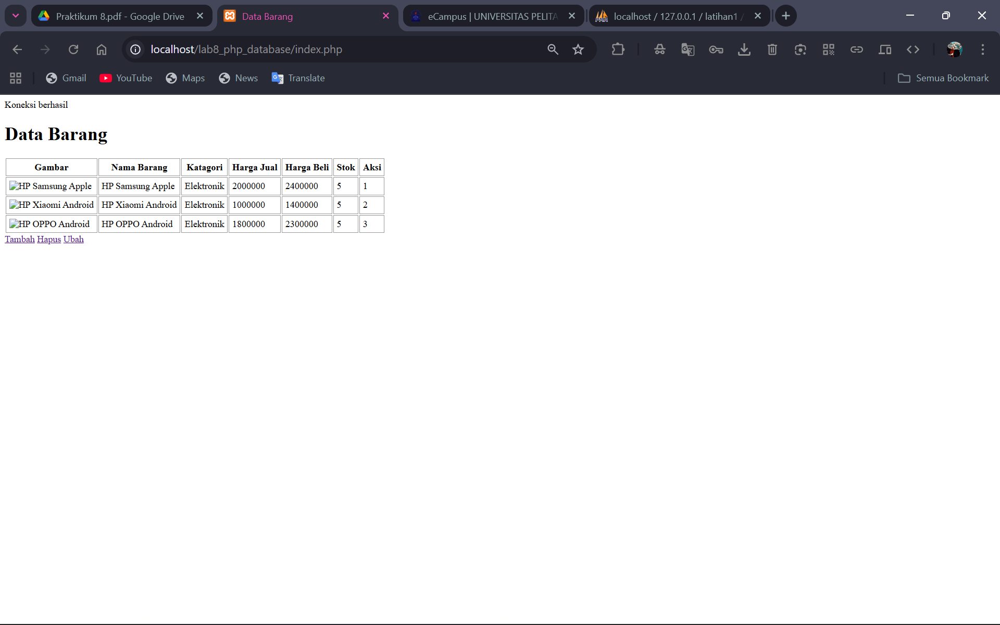
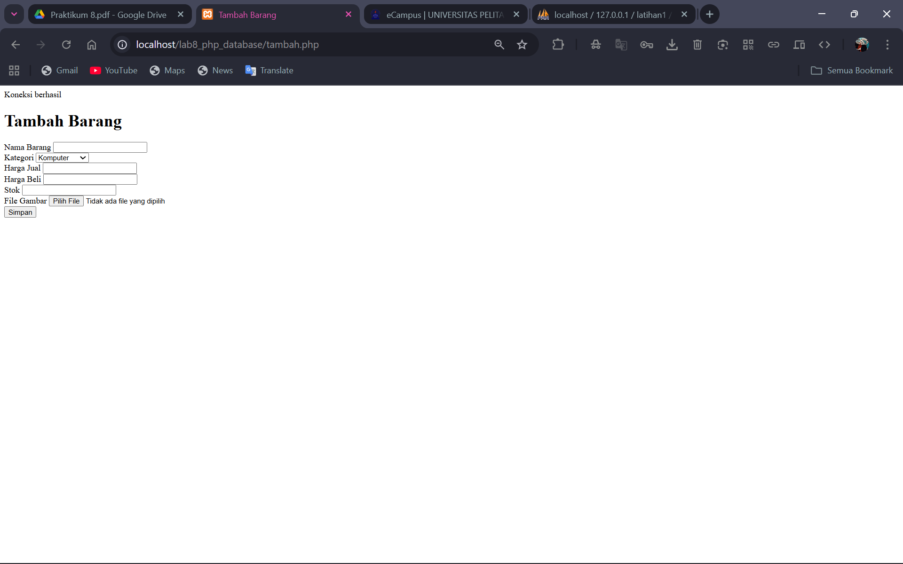
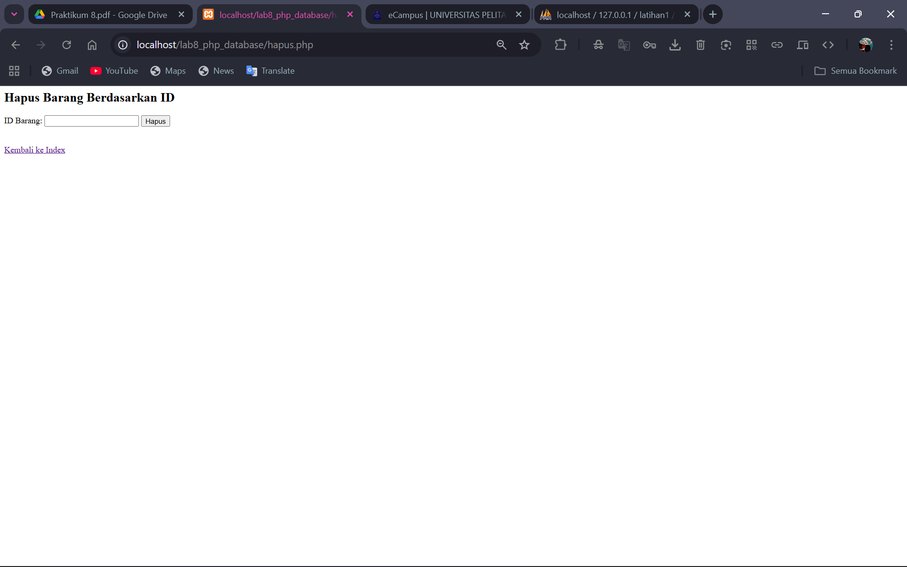
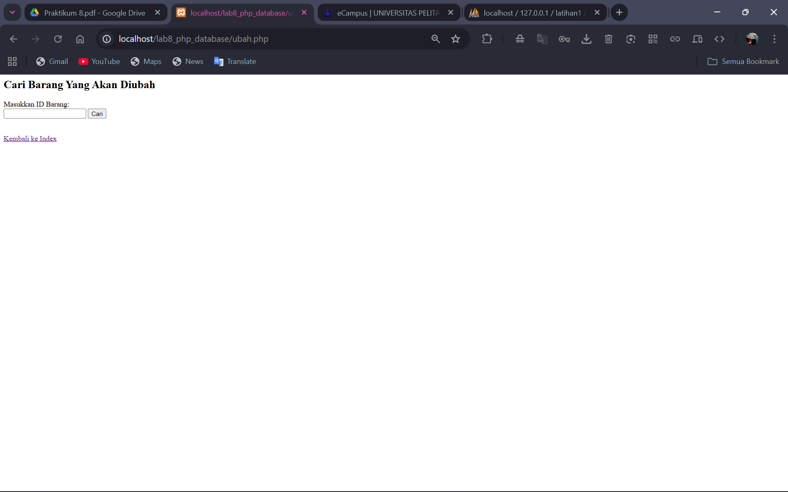
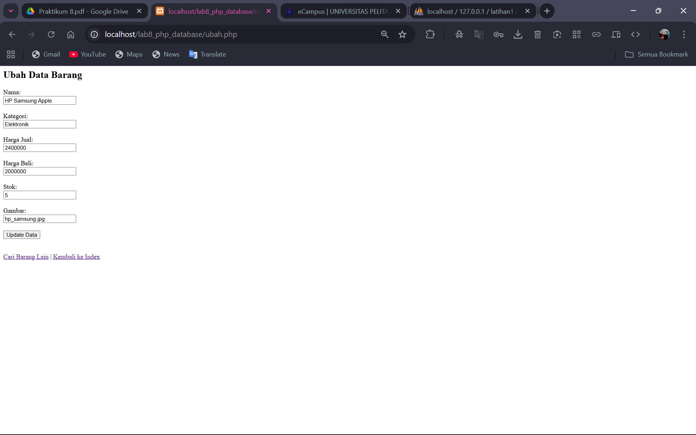

# Lab8Web
```
Nama:  Fathan Atallah Rasya Nugraha
NIM:   312410425
Kelas: TI.24.A3
```

# Tampilan Awal (Index.php)

Terdapat tampilan barang apa saja yang ada didalam database. Selain itu juga ada tiga buah tombol yaitu tambah, hapus, dan ubah.
- Tambah : Untuk menambahkan barang ke database
- Hapus : Untuk menghapus barang dari database
- Ubah : Untuk mengubah barang yang ada di database

# Tampilan Tambah

Di dalam sini, user bisa menambahkan barang mulai dari nama barang, kategori, harga jual, harga beli, stok, dan bisa menambahkan gambar juga.

# Tampilan Hapus

Di dalamnya terdapat sebuah input untuk memasukkan id barang yang ingin dihapus, jika sudah tekan tombol hapus maka barang akan otomatis terhapus dari database.

# Tampilan Ubah

Di dalamnya user bisa memasukkan id barang yang ingin diubah.

Lalu setelah memasukkan id barang user bisa mengubah barang mulai dari nama barang, kategori, harga jual, harga beli, stok, dan mengubah gambar.
